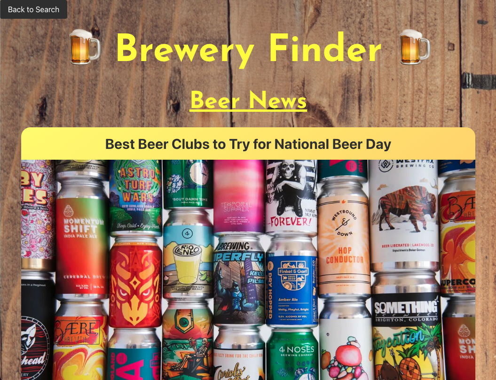

# Brewery-Finder

## Description

The purpose of this application is to allow beer enthusiasts to find breweries near them so that they can try local beers.

* **The final result can be found here:** [Brewery Finder](https://elmiquea.github.io/Brewery-Finder/)

## Features

When a brewery type is selected, and search button is clicked, the five closest breweries are presented and a map is populated with each location.

When a brewery type is selected, and a zip code is entered, the five closest breweries to the center of that zip code are presented and a map is populated with each location.

Each brewery listing includes:
- Name
- Address
- Phone number
- Website
- A button to select if the user liked the brewery
- A button to select if the user disliked the brewery

When the like button is clicked, the brewery is saved in the favorites page, and a map is populated with each liked brewery.

When the dislike button is clicked, the brewery is removed from favorites page (if it was previously liked), and it will no longer show up when you search for breweries.

When the news button is clicked, three relevant news articles relating to beer are presented.

Each news articles includes:
- Title of article
- Image for article
- Subheading for article
- Snippet of article content
- Link to article to read more

* **The following image shows a demonstration of the web applications appearance and functionality:**  
Home Page:

Favorites Page:

News Page:

## Technologies Used

* HTML
* CSS
* Bulma
* JavaScript
* Get Geo API
* OpenWeather Geocoding API
* Open Brewery API
* Google Maps API
* News API

## Credits

* Code written by Conner Martin, Cory Benton, and Elvis Queliz